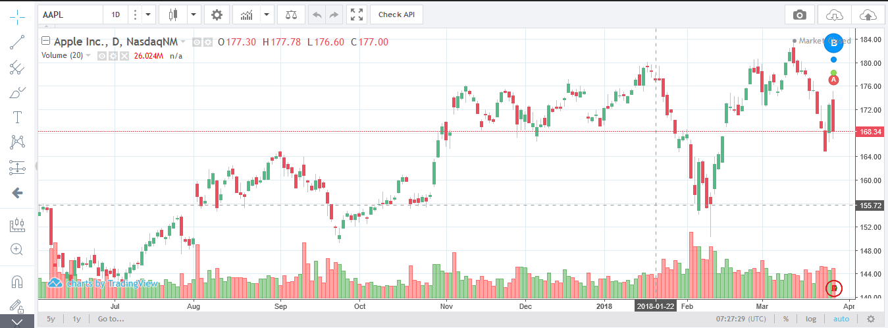

# TradingView Charting Library and Angular 5 Integration Example

## Demo

## What is Charting Library

Charting Library is a standalone solution for displaying charts. This free, downloadable library is hosted on your servers and is connected to your data feed to be used in your website or app. [Learn more and download](https://www.tradingview.com/HTML5-stock-forex-bitcoin-charting-library/).

## What is Angular

Angular is a platform that makes it easy to build applications with the web. Angular combines declarative templates, dependency injection, end to end tooling, and integrated best practices to solve development challenges. Angular empowers developers to build applications that live on the web, mobile, or the desktop. [Learn more](https://angular.io/docs).

## About This Project

This project was generated with [Angular CLI](https://github.com/angular/angular-cli) version 1.7.4.
